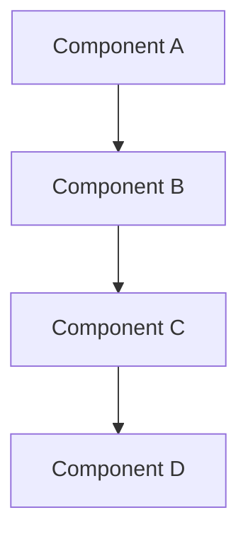

# How We Built [Project Name]: From Concept to Production

<!--truncate-->

## The Challenge 🎯

[Describe the problem you set out to solve]

**Key Requirements:**
- [Requirement 1]
- [Requirement 2] 
- [Requirement 3]

**Constraints:**
- [Constraint 1: e.g., Budget limitations]
- [Constraint 2: e.g., Timeline constraints]
- [Constraint 3: e.g., Technical limitations]

## Architecture Overview 🏗️

[High-level description of the system architecture]



### Core Components

1. **[Component 1]**: [Description and responsibility]
2. **[Component 2]**: [Description and responsibility]
3. **[Component 3]**: [Description and responsibility]

## Technology Stack 🛠️

### Backend
- **Language:** [Language and version]
- **Framework:** [Framework and why chosen]
- **Database:** [Database and rationale]
- **Infrastructure:** [Cloud provider, containers, etc.]

### Frontend
- **Framework:** [Frontend framework]
- **State Management:** [Solution used]
- **Styling:** [CSS framework/approach]

### DevOps & Tooling
- **CI/CD:** [Pipeline setup]
- **Monitoring:** [Monitoring solutions]
- **Testing:** [Testing frameworks and strategies]

```yaml
# Example configuration
service:
  name: [service-name]
  port: [port]
  environment:
    - [ENV_VAR]: [value]
```

## Development Process 👥

### Team Structure
- [Role 1]: [Responsibilities]
- [Role 2]: [Responsibilities]
- [Role 3]: [Responsibilities]

### Methodology
- **Development approach:** [Agile/Scrum/Kanban]
- **Sprint duration:** [Length]
- **Code review process:** [Description]

### Key Milestones
1. **[Milestone 1]** ([Date]): [Achievement]
2. **[Milestone 2]** ([Date]): [Achievement]
3. **[Milestone 3]** ([Date]): [Achievement]

## Technical Deep Dives 🔍

### [Key Feature 1]

[Detailed explanation of a complex feature]

```[language]
// Code example
function [functionName]() {
    // Implementation details
}
```

**Challenges faced:**
- [Challenge 1 and solution]
- [Challenge 2 and solution]

### [Key Feature 2]

[Another important technical aspect]

### Performance Optimization

- **Initial performance:** [Baseline metrics]
- **Optimization strategies:** [What was done]
- **Final performance:** [Improved metrics]

## Lessons Learned 📚

### What Went Well ✅

1. **[Success 1]**: [Description and why it worked]
2. **[Success 2]**: [Description and impact]
3. **[Success 3]**: [Description and benefits]

### Challenges Overcome 🚧

1. **[Challenge 1]**: [Problem and solution]
2. **[Challenge 2]**: [Problem and solution]
3. **[Challenge 3]**: [Problem and solution]

### What We'd Do Differently 🔄

- [Change 1]: [Rationale]
- [Change 2]: [Rationale]
- [Change 3]: [Rationale]

## Deployment & Operations 🚀

### Infrastructure
- **Hosting:** [Platform details]
- **Scaling strategy:** [Horizontal/vertical scaling approach]
- **Backup & Recovery:** [Strategy and tools]

### Monitoring & Observability
```[language]
// Example monitoring setup
monitoring:
  metrics: [metrics collected]
  alerts: [alert conditions]
  dashboards: [dashboard setup]
```

### Security Considerations
- [Security measure 1]
- [Security measure 2]
- [Security measure 3]

## Results & Impact 📊

### Technical Metrics
- **Performance:** [Response times, throughput]
- **Reliability:** [Uptime, error rates]
- **Scalability:** [Load handling capacity]

### Business Impact
- **User adoption:** [Numbers and growth]
- **Business metrics:** [Revenue, conversion, etc.]
- **Team efficiency:** [Development velocity improvements]

## Future Roadmap 🗺️

### Planned Improvements
- [Improvement 1]: [Timeline and benefits]
- [Improvement 2]: [Timeline and benefits]
- [Improvement 3]: [Timeline and benefits]

### Technical Debt
- [Debt item 1]: [Priority and plan]
- [Debt item 2]: [Priority and plan]

## Open Source & Community 🌍

[If applicable, discuss open source contributions, community involvement, or plans to open source parts of the project]

## Resources & Links 🔗

- **Live Project:** [URL if public]
- **Documentation:** [Link to docs]
- **Source Code:** [Link if open source]
- **Technical Blog Posts:** [Related posts]
- **Conference Talks:** [Presentations about the project]

---

## Want to Learn More?

Interested in the technical details? Have questions about our approach? Feel free to reach out or drop a comment below!

---

**Tags:** #engineering #architecture #[technology] #casestudy #development
